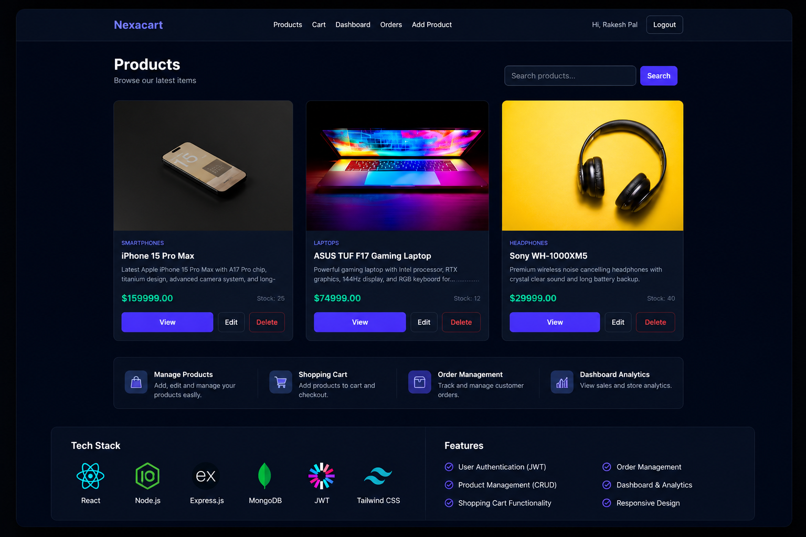

# 🛒 NexaCart - Full Stack MERN E-Commerce Platform

<p align="center">
  
</p>

## 🚀 Overview

NexaCart is a modern full-stack MERN E-Commerce Platform built with React, Redux Toolkit, Node.js, Express.js, MongoDB, and JWT Authentication.

The platform provides a complete online shopping experience including authentication, product management, shopping cart functionality, order tracking, and admin dashboard features.

---

## ✨ Features

### User Features

- User Registration & Login
- JWT Authentication
- Browse Products
- Search Products
- Product Details Page
- Add To Cart
- Update Cart Quantity
- Place Orders
- My Orders Page
- Responsive Design

### Admin Features

- Admin Dashboard
- Add Products
- Edit Products
- Delete Products
- Manage Orders
- Manage Inventory
- Product Analytics

---

## 🛠️ Tech Stack

### Frontend

- React.js
- Vite
- Redux Toolkit
- React Router DOM
- Tailwind CSS
- Axios

### Backend

- Node.js
- Express.js
- MongoDB Atlas
- Mongoose
- JWT Authentication
- bcryptjs

### Deployment

- Frontend: Vercel
- Backend: Render
- Database: MongoDB Atlas

---

## 📸 Screenshots

### Products Page


---

## 📂 Project Structure

```bash
NexaCart/
│
├── frontend/
│   ├── src/
│   ├── components/
│   ├── pages/
│   └── redux/
│
├── backend/
│   ├── controllers/
│   ├── routes/
│   ├── models/
│   ├── middleware/
│   └── config/
│
└── README.md
```
